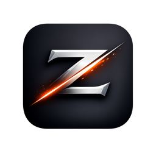
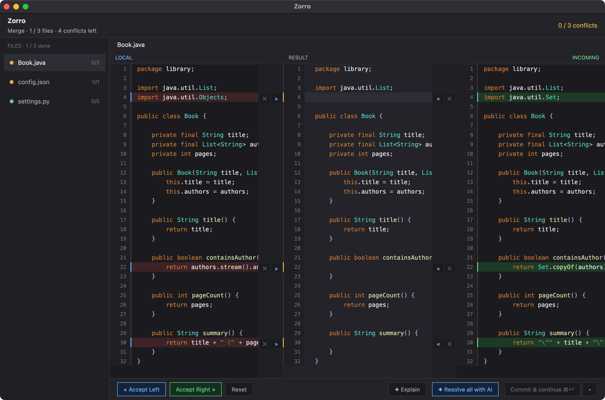

<p align="center">
  
</p>

<h1 align="center">Zorro</h1>

<p align="center"><strong>A modern Git merge conflict resolution tool for macOS.</strong></p>

Zorro is a native macOS application focused exclusively on resolving Git merge
conflicts. Inspired by the JetBrains merge tool, it provides a fast,
keyboard-driven, developer-friendly interface built on the [Zed](https://zed.dev)
graphics engine (GPUI).

> Resolving merge conflicts should be fast, visual, and safe.

<p align="center">
  
</p>

---

## Status

Early development. What works today:

- **`zorro-core`** — the headless conflict engine, fully tested:
  - Parses both `merge` and `diff3`/`zdiff3` conflict marker styles.
  - Models per-conflict resolutions: accept current / incoming / base / both /
    manual edit.
  - Renders resolved output, preserving CRLF/LF line endings and trailing
    newlines; a fully-unresolved document round-trips byte-for-byte.
  - Word- and character-level token diffing for in-conflict highlighting.
  - Discovers conflicted files and the active workflow (merge, rebase,
    cherry-pick, revert) via the `git` CLI.
- **`zorro`** — the GPUI macOS app:
  - Sidebar file list with per-file resolved/total counts.
  - JetBrains-style **full-height** three-column merge: **Local · Result ·
    Incoming**, row-aligned and **syntax-highlighted** (Rust, TS/JS, Go, Python,
    C#, Java, JSON, YAML). The Result column shows the **whole file** — unchanged
    context plus every conflict — with line numbers.
  - The Result's conflict regions are live, editable multiline code editors:
    cursor, typing, Enter/Backspace/Delete, arrows, Home/End, click-to-place,
    click-drag and shift-arrow **selection**, Select-All, and **copy/cut/paste**.
  - **Per-line diff colouring** inside each conflict: lines only on the left are
    red (removed), lines only on the right are green (added).
  - Gutters between the columns carry per-hunk accept (`»`/`«`) and ignore (`✕`)
    actions. Resolving a hunk **clears the rejected side** and swaps the gutter
    to an undo (`↺`), so done hunks read as done.
  - **Resizable panes** — drag the gutters between Local · Result · Incoming.
  - **Autosave**: resolved files are written to disk automatically (no Save
    button). A bottom action bar has global **« Accept Left / Accept Right »**.
  - **Commit & Continue** finishes the Git operation (commit the merge / continue
    the rebase / cherry-pick / revert) and is disabled until *every* conflict in
    *every* file is resolved and valid. Its **▾** menu offers **Abort** (restore
    pre-merge state) and **Reset --hard**.
  - Each conflict is flagged amber (pending) until resolved, then green.
  - **Structural validation**: a resolved file whose brackets don't balance is
    marked **red** in the sidebar and save is blocked until it's fixed.
  - **diff3 offer**: repos using standard markers get a banner offering to switch
    to diff3 (regenerates the current conflicts with the common ancestor).
  - **AI assist**: `✦ Resolve all with AI` resolves every conflict in the file
    (provider calls run concurrently; each result is applied inline, with live
    progress, and is undoable + not saved until you Save). `✦ Explain` describes
    the focused conflict.
  - Keyboard-first navigation and resolution; writes resolved files to disk.

### AI-assisted resolution

`zorro-core::ai` is a provider-agnostic layer: it builds the prompt (base ·
current · incoming · surrounding context · path · language), parses the
response (fenced code + a confidence marker), and estimates confidence
(import-only / tiny → High, small → Medium, large → Low) as a fallback.

Providers implement `AiProvider`. The default is **Claude Code** (`claude -p`,
prompt piped over stdin); `CliProvider::codex()` and `CliProvider::ollama(model)`
are ready to use too. CLI providers run locally — no source leaves the machine
beyond what the chosen tool sends.

See [`SPEC.md`](SPEC.md) for the full product vision and roadmap.

---

## Download

### Homebrew (recommended)

```bash
brew install --cask baboons/tap/zorro
```

This installs `Zorro.app` and a `zorro` command on your `PATH` (which opens the
app on the current repo — see [Use with Git](#use-with-git)). Upgrade with:

```bash
brew upgrade --cask zorro
```

### Manual

Tagged releases attach a prebuilt **Apple Silicon** app —
`Zorro-aarch64-apple-darwin.zip` — to the [GitHub release page][releases]
(built by `.github/workflows/release.yml`). Unzip and drag `Zorro.app` to
`/Applications`.

It's unsigned, so on first launch macOS Gatekeeper will block it — **right-click
→ Open** (once), or clear the quarantine flag:

```bash
xattr -dr com.apple.quarantine /Applications/Zorro.app
```

(Zorro notifies you in-app when a newer release is available.)

[releases]: https://github.com/baboons/zorro/releases

## Use with Git

Zorro is **session-based**: it opens a whole repository that's mid-merge and
resolves *every* conflicted file at once (then commits / continues for you). So
the workflow is simply "run Zorro in the repo while you have conflicts" — not
Git's per-file `mergetool` protocol.

**1. Install** via Homebrew (`brew install --cask baboons/tap/zorro`) — this
already puts a `zorro` command on your `PATH`, so **skip to step 3**.

**2. (Manual installs only.)** If you dragged `Zorro.app` in by hand, add the
`zorro` command yourself:

```bash
# Apple Silicon Homebrew uses /opt/homebrew/bin; otherwise /usr/local/bin.
cat > /opt/homebrew/bin/zorro <<'EOF'
#!/bin/sh
exec open -na "Zorro" --args "$PWD"
EOF
chmod +x /opt/homebrew/bin/zorro
```

**3. Resolve conflicts.** When a merge/rebase/cherry-pick stops with conflicts:

```bash
git merge feature        # … CONFLICT
zorro                    # opens Zorro on this repo
```

Resolve each file (accept sides, edit, or **✦ Resolve all with AI**); files
autosave as they're completed. When everything is green, click
**Commit & continue** — Zorro stages the files and finishes the Git operation
(`git commit` for a merge, `--continue` for a rebase/cherry-pick/revert). The
**▾** menu offers **Abort** or **Reset --hard** if you'd rather bail out.

**Optional — a Git alias** so you can launch it as a subcommand:

```bash
git config --global alias.zorro '!zorro'
git zorro                # same as running `zorro` in the repo
```

> **Why not `git mergetool`?** That protocol invokes a tool once *per file* with
> `$LOCAL`/`$REMOTE`/`$MERGED`. Zorro intentionally works on the whole session
> instead (so it can reason across files and commit when done), which the simple
> `zorro` command above fits better.

## Building

GPUI is consumed from the Zed monorepo and requires the Rust toolchain Zed
pins. That version is captured in [`rust-toolchain.toml`](rust-toolchain.toml)
(currently **1.95.0**) and `rustup` will install it automatically.

```bash
# Run the headless engine tests (fast, no GPUI):
cargo test -p zorro-core

# Build and run the macOS app (first GPUI build takes a while):
cargo run -p zorro            # discovers conflicts in the current repo
cargo run -p zorro -- /path/to/repo
```

The app discovers the conflicted files in the repository at the current
directory (or the path passed as the first argument) and opens a window. With no
repository or no conflicts, it shows a friendly empty state.

To build a proper `Zorro.app` (with the icon, for the Dock/Finder):

```bash
./scripts/bundle.sh            # → dist/Zorro.app  (release)
open dist/Zorro.app
./scripts/make-icon.sh         # regenerate Zorro.icns from assets/icon.png
```

---

## Keyboard shortcuts

| Action            | Shortcut |
|-------------------|----------|
| Next conflict     | <kbd>F7</kbd> |
| Previous conflict | <kbd>⇧F7</kbd> |
| Accept Current    | <kbd>⌥←</kbd> |
| Accept Incoming   | <kbd>⌥→</kbd> |
| Accept Both       | <kbd>⌥↓</kbd> |
| Next file         | <kbd>⌘↓</kbd> |
| Previous file     | <kbd>⌘↑</kbd> |
| Save file         | <kbd>⌘S</kbd> |

Click into a **Result** editor to edit the merged text directly. While it holds
focus: arrows, <kbd>Home</kbd>/<kbd>End</kbd>, <kbd>⏎</kbd>, <kbd>⌫</kbd>,
<kbd>⌦</kbd>; <kbd>⇧</kbd>+arrows or click-drag to select, <kbd>⌘A</kbd> select
all, <kbd>⌘C</kbd>/<kbd>⌘X</kbd>/<kbd>⌘V</kbd> copy/cut/paste.

---

## Architecture

```
zorro/
├── crates/
│   ├── zorro-core/   # headless engine: conflict parsing, diff, session, git
│   │                 # (no UI, no third-party dependencies)
│   └── zorro/        # GPUI macOS app (depends on zorro-core)
└── rust-toolchain.toml
```

The split keeps all conflict logic in a fast, dependency-free, fully-tested
library; the GPUI crate is purely presentation and input.

---

## License

MIT OR Apache-2.0
